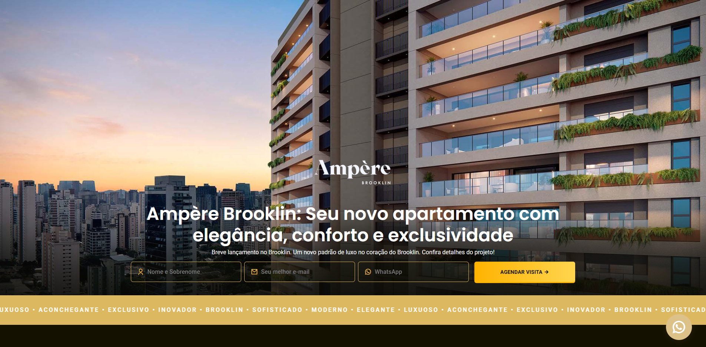

# 🏡 Ampère | Landing Page Imobiliária

Neste projeto desenvolvi uma **landing page imobiliária** com base em um design pré-definido. O objetivo foi criar um case de estudo para aplicar meus conhecimentos em HTML, CSS e JavaScript, explorando desde a responsividade até a interatividade em situações reais de mercado.

O projeto combina as três tecnologias fundamentais do front-end para entregar uma interface **moderna, fluida e atrativa, alinhada às boas práticas de usabilidade e performance.**

---

## 🚀 Demo

🔗 [Clique aqui para ver o projeto online](https://ampere-landing-page.vercel.app/)

---

## 🖼️ Preview

---

## 📌 Funcionalidades

- ✅ Estruturação completa em HTML semântico
- 🎨 Design responsivo
- 🖼️ Sliders dinâmicos (imagens principais e galeria de plantas)
- 📍 Integração com Google Maps para localização
- 📑 Formulário de contato com máscara e validação
- 💬 Sistema de comentários simulados (reviews estilo Google)
- ️⬆️ Botão flutuante de "Voltar ao topo" com animação suave
- ⏩ Carrossel com suporte a clique, swipe e autoplay

---

## 🛠️ Tecnologias Utilizadas

- **HTML5**  
- **CSS3 (Flexbox + Responsividade)**  
- **JavaScript (manipulação do DOM, validações)**  
- **Google Fonts (Poppins, Roboto)**  
- **Deploy na Vercel**  

---

## 📚 Aprendizados

Durante o desenvolvimento deste projeto, pude consolidar e aprofundar vários conceitos importantes de front-end:

- HTML semântico: Melhor organização do código e estruturação da página.
- CSS responsivo: Uso de media queries e boas práticas para adaptar a interface em diferentes telas.
- Flexbox e Grid: Aplicação para criar layouts modernos, fluidos e consistentes.
- JavaScript prático: Manipulação do DOM para formulários, sliders e interações dinâmicas.
- Boas práticas de UI/UX: Atenção à navegação, experiência do usuário e fluidez da página.
- Organização de arquivos: Separação clara entre estilos base, responsividade e scripts.

## 🙌 Agradecimentos

- Inspiração do design por [Felipe Sullivan](https://www.behance.net/gallery/205171805/Pagina-de-vendas-Imobiliaria)
- Projeto desenvolvido por [Lucas Lehm](https://github.com/lucaslehm). 🚀